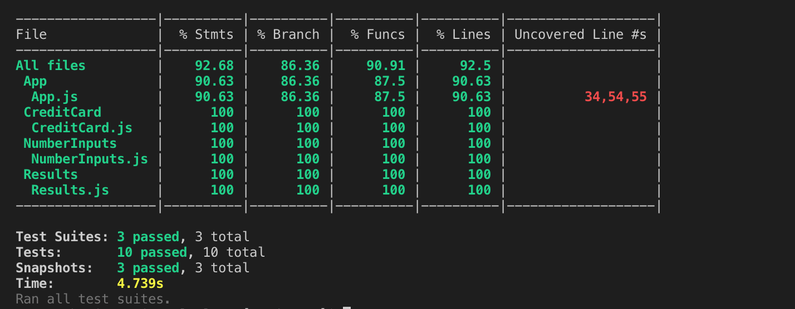

## Screenshots



## Technologies Used
- React 
- SCSS
- Jest/Enzyme
- Material UI

## Installation
```
git clone https://github.com/evanmarkowitz/tip-calculator.git
```
Once you have cloned the repo, install the library dependencies. Run:

```
npm install
```
To view the app in action, run the following command in your terminal:

```
npm start
```
Then, go to http://localhost:3000/ in your browser to see the code running in the browser.
